# Lecture 02

## Betley Rules

### Data strucutres

#### Packing & Encoding
- save variables to the registers
- using structures - save space and speed up

#### Argumentation

- add argument to speed up oparetion
- ex. add `tail` link to linked list


#### Precomputation

- example Pascal's Trinagle

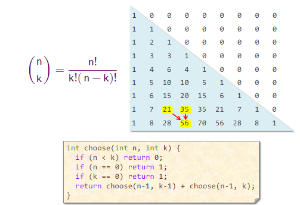

#### Compile-Time Initialization

- store data during compilation => save work during executing time
- *hardcore values into code or precalucle during compilation*

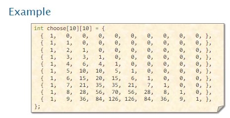

#### Caching

- not only hardware, we can cache software too
- store results that have been accessed recently so that the program need not compute them again

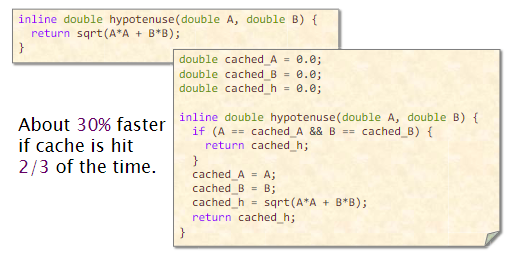

#### Sparsity

- avoid storing and computation on zeroes

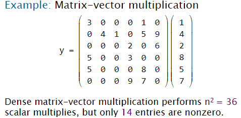
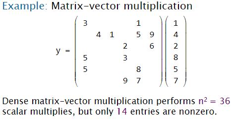

### Logic

#### Constant Folding and Propagation

- evaluate constant expressions and substitute the result into futher expressions, all during compilation

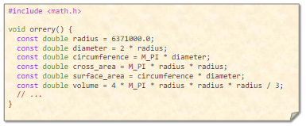

#### Common-Subexpression Elimination

- aviod computatationg the same expression multiple times by evaluating the same expression multiple times by evaluating the expression once and storing the result for later use

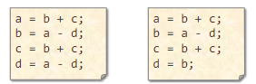

#### Algebraic Indetities

- to replace expensive algebraic expressions with algebraic equivalents that requiere less work

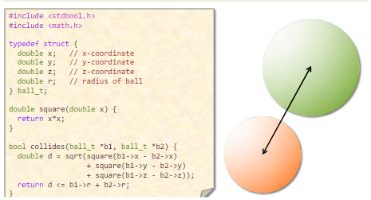
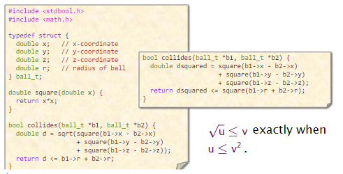

#### Short-Circuiting

- when perfroming a series of test, that idea of *short-circutting* is to stop evaluating as soon as you know the answare.

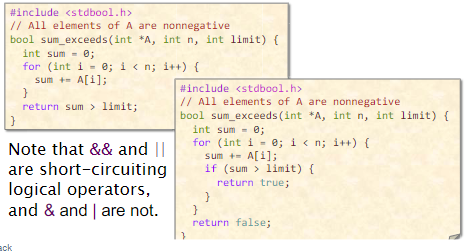

#### Ordering Tests

- order test that are more often "successful" befeore tests that are rarely successful

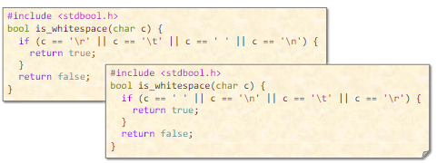

#### Creating a Fast Path

- first time try faster computation and only if the first type of cumputation is not success, do longer

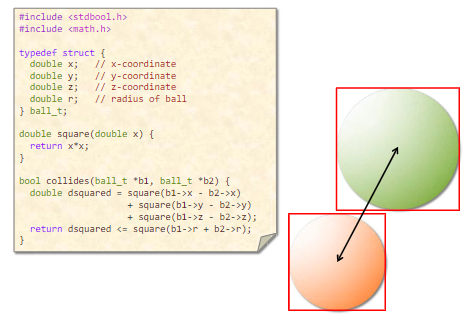
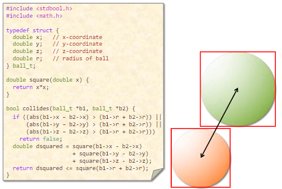

#### Combining Tests

- the idea is to replace a sequence of test with one test or switch
- *insted of sequencial, create decisions trees*

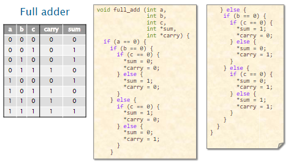
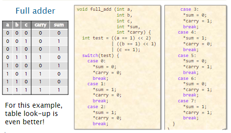

### Loop

#### Hoisting

- (loop-invariant code motion) is to avoid recomputating loop-invariant code each time through the body of a loop

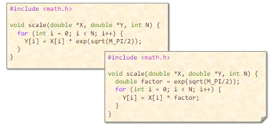

#### Sentinels

**Sentinels** are special dummy values placed in a data structer to simplify the logic of boundary conditions, and in praticular, the handling of loop-exit tests.

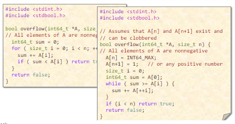

#### Loop Unrolling

**Loop unrolling** attempts to save work by combining several consecutive iterations of a loop into a single iteration, thereby reducing the total number of iterations of the loop and, consequently, the number of times that the instructions that consterol the loop must be executed.

**Full** loop unrolling: All iterations are unrolled.
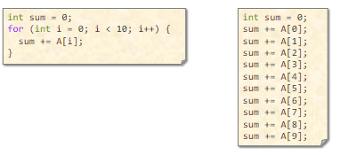

**Parial** loop inrollign: Several, but not all, of the iterations are undolled.
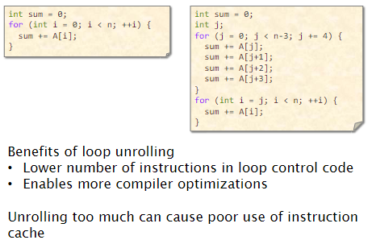


#### Loop Fusion

- also called **jamming** - is to combine multiple loops over the same index range into a single loop body, thareby saving the overhead of loop control

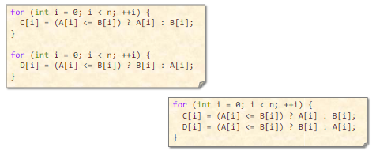

#### Eliminating Waster Iterations

- idea is to modify loop bounds to avoid executing loop iterations over essentially empty loop bodies

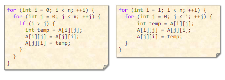

### Function

#### Inlining

- the idea is to avoid the overhead of the function call by replacing a call to the function with the body of the function itself

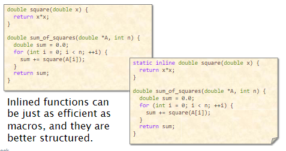


#### Tail-Recursion Elimination

- the idea is to replace a recursive call that occurs as the last step of a function with a branch, saving function-call overhead

#### Coarsening Recursion

- idea is to increase the size of the base case and handle it with more efficient code that avoids function-call overhead

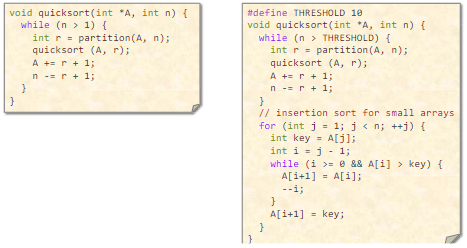


## Profiling

- identifiaction where code is slow

### Bottlenecks

- (application) code
- 3rd party libraries
- OS krenel
- memory
- network
- disk
- ...

Is challenging to determing when proble is. Software is so complex.

*On Linux we know a lots performance tools*
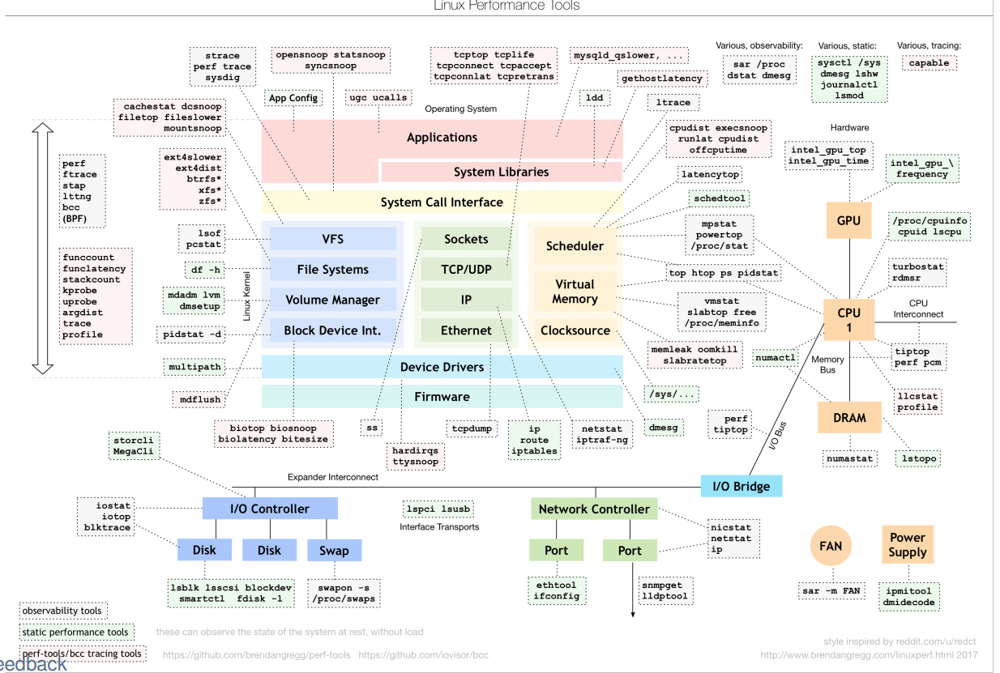

### Profiling tools

| In order to do:         | You can use:                |
| ----------------------- | --------------------------- |
| Manual instrumentation  | `printf()` and similar      |
| Static instrumentation  | *gprof* (GNU profiler)      |
| Dynamic instrumentation | *callgrid*, *cachegrind*    |
| Performace counter      | *oprofile*, *perf*          |
| Heap profiling          | *masif*, *google-perftools* |

#### Static instrumentation

grof usage:

```sh
gcc -pg ... -o program #Adds profiling code to every function and basic block
./program # Runs the program, it generates gmon.out file
gprof program
```

#### Event sampling

Static instrumentation has problems: overhead, modifies code:
- Basic idea of event sampling
  - When an interesting event occurs, look at where the program executes
  - Result is an histogram of addresses and event counts
- Events
  - Time, cache miss, branch-prediction miss, page fault
- Implementation
  - Timer interrupt → upon ISR entry, program address is stored on stack
  - Each event has a counting register in HW
    - Every N (configurable) events, an interrupt is generated

### Performance counter

- Hardware inside the CPU (Intel, ARM, ...)
- Software can configure which events to count and when/whether to generate interrupts
- In many cases can be accessed from application code

#### Linux tool `perf`

- discussed on labs

## C/C++ compiler

### Compilers flags (gcc, clang)

- Documentation is your friend:
  - Command (p)info gcc
  - https://gcc.gnu.org/onlinedocs/
  - Clang’s flags are mostly compatible with gcc
- Generate debugging information: -g
  - Optimization level: `-O0`, `-O1`, `-O2`, `-O3`, `-Os (size)`, `-Og` (debugging)
  - `-O2` is considered “safe”, `-O3` may be buggy
  - Individual optimization passes:
  - `-ftree-ccp`, `-fast-math`, `-fomit-frame-pointer`, `-ftree-vectorize`, ...
  - Find out which optimizations passes are active for given optimization level: `g++ -Q -O2 --help=optimizers`
- Code generation
- `-fpic`, `-fpack-struct`, `-fshort-enums`
- Machine dependent:
  - Generate instructions for given micro-architecture: `-march=haswell`, `-march=skylake` (will not run on older hardware)
  - Use only “older” instructions, but schedule them for for given μarch: `-mtune=haswell`, `-mtune=native`, `-m32`, `-minline-all-stringops`, ...

### Compiler internals overview

C/C++ compile typically contains the fillowing parts:

- Compiler **fronteend** - coinverts source code int ointermediate represntation (IR)
- **Sematic checks** - ensuring that the program *make sense*
- **Optimalization** passes
- A target-dependent **backend** - generate assbemly code or machine code
- **Linker** - can be, and usually is, indepent of the compiler