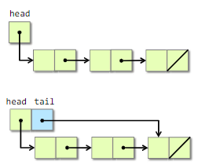

# Notes

## Betley Rules

### Data strucutres

#### Packing & Encoding
- save variables to the registers
- using structures - save space and speed up

#### Argumentation

- add argument to speed up oparetion
- ex. add `tail` link to linked list

#### Precomputation

- example Pascal's Trinagle

#### Compile-Time Initialization

- store data during compilation => save work during executing time
- *hardcore values into code or precalucle during compilation*

#### Caching

- not only hardware, we can cache software too
- store results that have been accessed recently so that the program need not compute them again

#### Sparsity

- avoid storing and computation on zeroes

### Logic

#### Constant Folding and Propagation

- evaluate constant expressions and substitute the result into futher expressions, all during compilation

#### Common-Subexpression Elimination

- aviod computatationg the same expression multiple times by evaluating the same expression multiple times by evaluating the expression once and storing the result for later use

#### Algebraic Indetities

- to replace expensive algebraic expressions with algebraic equivalents that requiere less work

#### Short-Circuiting

- when perfroming a series of test, that idea of *short-circutting* is to stop evaluating as soon as you know the answare.

#### Ordering Tests

- order test that are more often "successful" befeore tests that are rarely successful

#### Creating a Fast Path

- first time try faster computation and only if the first type of cumputation is not success, do longer

#### Combining Tests

- the idea is to replace a sequence of test with one test or switch
- *insted of sequencial, create decisions trees*

